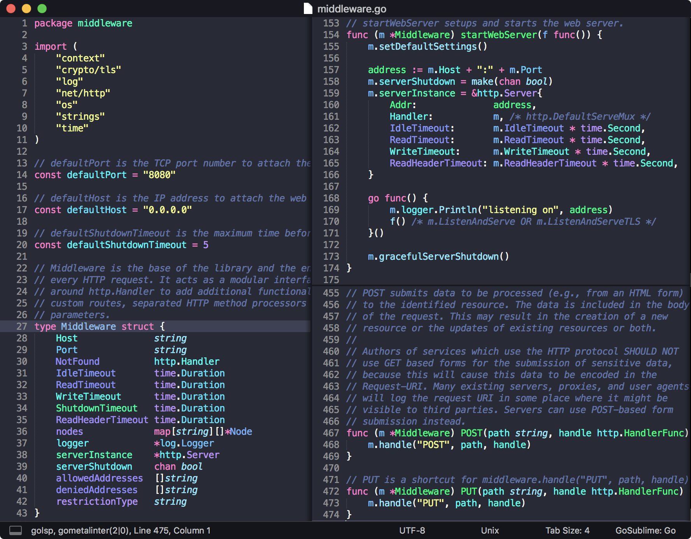
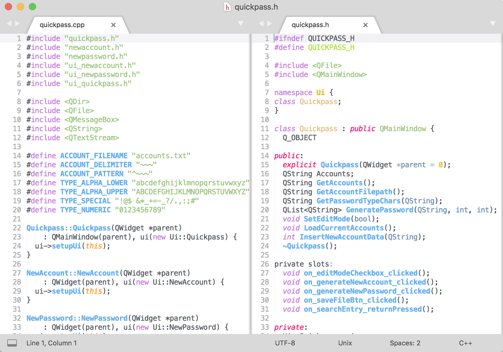

# Monnokay — Color Scheme

Color scheme for [TextMate](https://macromates.com/) and [SublimeText](https://www.sublimetext.com/) inspired by [Monokai](http://www.monokai.nl/blog/2006/07/15/textmate-color-theme/) and [Dracula](https://draculatheme.com/sublime/).

This color scheme supports a special mode called [Hashed Syntax Highlighting](https://www.sublimetext.com/docs/3/color_schemes.html#hashed_syntax_highlighting), where each token matching the scope specified will receive a unique color from one, or more, gradients. Some editors refer to this style of highlighting as _"Semantic Highlighting"_. It is available in dark and light gradients to accommodate to your visual preferences during the day.

## Installation

1. Menu > Preferences > Browse Packages…
1. Download the `.sublime-color-scheme` file(s)
1. Menu > Tools > Command Palette…
1. Search _"UI: Select Color Scheme"_
1. Select the color scheme from the list
1. Restart the code editor if necessary

---

