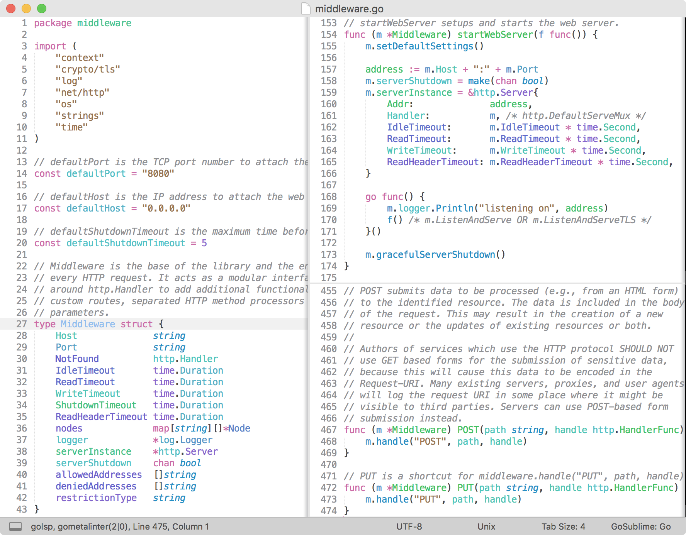

### Monnokay — Color Scheme

Color scheme for [TextMate](https://macromates.com/) and [SublimeText](https://www.sublimetext.com/) based on [Monokai](http://www.monokai.nl/blog/2006/07/15/textmate-color-theme/) and [One Dark](https://github.com/atom/one-dark-syntax).

